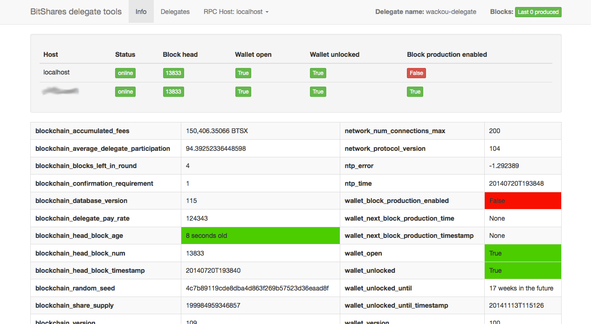

BitShares delegate tools
------------------------

there are 2 tools currently provided:
 - command line util allowing to quickly build and run the bitshares client
 - web app allowing to monitor a running instance of the client
   and send an email or push notification on failure
   
If you like these tools, please vote for [my delegate](http://digitalgaia.io/wackou.html) to
support further development, and feel free to visit my page for other delegate
proposals at [digitalgaia.io](http://digitalgaia.io). Thanks!

Command-line client
===================

just run the ``bts`` script with the command you want to execute:

    $ bts -h
    usage: bts [-h] [-r]
               {clean_homedir,clean,build,build_gui,run,run_gui,list} [hash]
    
    following commands are available:
      - clean_homedir    : clean home directory. WARNING: this will delete your wallet!
      - clean            : clean build directory
      - build [hash]     : update and build bts client
      - build_gui [hash] : update and build bts gui client
      - run [hash]       : run latest compiled bts client, or the one with the given hash or tag
      - run_gui          : run latest compiled bts gui client
      - list             : list installed bitshares client binaries
    
    Example:
      $ bts build 0.4.7
      $ bts run
    
      $ bts build_gui 0.4.14
      $ bts run_gui
    
    
    positional arguments:
      {clean_homedir,clean,build,build_gui,run,run_gui,list}
                            the command to run
      hash                  the hash of the desired commit
    
    optional arguments:
      -h, --help            show this help message and exit
      -r, --norpc           run binary with RPC server deactivated
    
    You should also look into ~/.bts_tools/config.json to tune it to your liking.


Monitoring web app
==================

TODO: write better instructions for setup/running

You should edit the bitshares_delegate_tools/config.json file and then run:

    $ python -m bitshares_delegate_tools.wsgi
     

### Screenshots ###

Monitoring the status of your running bts client binary



Monitoring multiple instances at the same time, to have an overview while
running backup nodes and re-compiling your main node.


Things to know (best practices and "issues") READ IT !!!
========================================================

- to properly build the bitshares client in MacOSX:
  + you can (and should) build the binary with only homebrew libraries.
    Previous versions had trouble compiling and could require you to hand-compile
    some dependencies, but newer homebrew libs should compile properly
  + ```readline``` needs to be installed by brew and you need to run
    ```brew link --force readline``` to take precedence over the outdated
    version of the system

- when running the web client in uWSGI, make sure to:
  + set ```enable-threads = true```, otherwise you won't get the monitoring
    thread properly launched
  + set ```lazy-apps = true```, otherwise the stats object
    will not get properly shared between the master process and the workers,
    and you won't get any monitoring data
  + set ```workers = 1```, otherwise you will get multiple instances of the
    worker thread active at the same time
